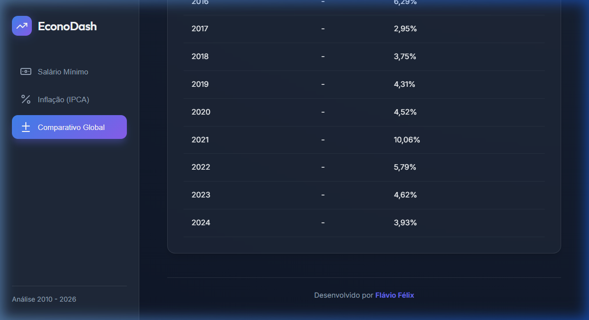

# 📊 EconoDash: Salário Mínimo vs Inflação (2010 - 2026)

Este projeto é um painel de análise econômica desenvolvido em **JavaScript ES6**, focado em visualização de dados e experiência do usuário (UX). Ele permite comparar a evolução do salário mínimo no Brasil com o índice de inflação IPCA de forma interativa e dinâmica.

---

## 🚀 Demonstração Visual

> _Nota: Certifique-se de que o caminho da imagem acima esteja correto no seu repositório GitHub após o push._

---

## ⚡ Funcionalidades Principais

- **Monitoramento Salarial**: Visualização clara do crescimento do salário mínimo ano a ano.
- **Análise de Inflação**: Acompanhamento do índice IPCA com formatação precisa.
- **Dashboard Comparativo**: Gráfico de dois eixos (Y) que cruza dados de renda e inflação.
- **Design Premium**: Interface baseada em **Glassmorphism**, modo escuro e fontes modernas.
- **Navegação Dinâmica**: Troca de visualizações sem recarregamento de página.
- **Responsividade Total**: Layout adaptável para desktop, tablets e smartphones.

---

## 🛠️ Tecnologias Utilizadas

- **Linguagem**: JavaScript (ES6+ Modules)
- **Visualização**: [Chart.js](https://www.chartjs.org/) para gráficos interativos.
- **Estilização**: CSS Nativo (Custom Properties, Flexbox, Grid).
- **Ícones**: [Lucide Icons](https://lucide.dev/).
- **Tipografia**: Google Fonts (Outfit & Inter).
- **Deploy**: [Vercel](https://salario-sigma.vercel.app/).

---

## 📂 Estrutura de Arquivos

- `index.html`: Estrutura semântica do dashboard.
- `style.css`: Design system e responsividade.
- `script.js`: Lógica de front-end e renderização de gráficos.
- `salario_minimo.js`: Coleção de dados históricos de salários.
- `inflacao.js`: Coleção de dados históricos do IPCA.
- `terminal.js`: Script original para consulta via terminal/console.

---

## 🌍 Links do Projeto

- **Produção (Live View)**: [https://salario-sigma.vercel.app/](https://salario-sigma.vercel.app/)
- **Repositório**: [https://github.com/fau-33/salario](https://github.com/fau-33/salario)

---

## 👨‍💻 Desenvolvido por

**Flávio Félix**

> Projeto focado em demonstrar habilidades em **Data Visualization** e **Front-end Moderno**.

---

_Este README foi gerado para destacar o projeto no ecossistema de desenvolvedores e portfólio profissional._
